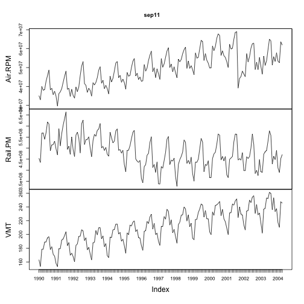

Practical Time Series Forecasting Note 1
========================================================

Notes taken for "Practical Time Series Forecasting" by Galit Shumueli

## Load Sep11 Transport Data

```r
require(zoo)
sep11 <- read.csv("../../data/time-series/Sept11Travel.csv")
sep11$Month <- as.yearmon(sep11$Month, "%b-%y")
sep11$Air.RPM <- as.integer(gsub(",", "", sep11$Air.RPM))
sep11$Rail.PM <- as.integer(gsub(",", "", sep11$Rail.PM))
sep11 <- as.zoo(sep11, sep11$Month)
sep11 <- sep11[, -1]
plot(sep11)
```

 

```r
frequency(sep11)
```

```
## [1] 12
```

```r
decompose(as.ts(sep11[, "Air.RPM"]))
```

```
## Error: non-numeric argument to binary operator
```

