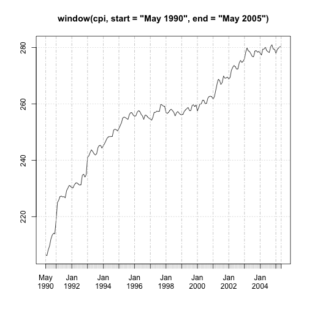

Introduction to R's time series facilities
========================================================
online resource: http://people.su.se/~lundh/reproduce/introduction_ts.pdf

###download data examples - run once

```r
library(utils)
library(xts)  ##build on top of zoo
```

```
## Loading required package: zoo
## 
## Attaching package: 'zoo'
## 
## The following objects are masked from 'package:base':
## 
##     as.Date, as.Date.numeric
```

```r
library(plyr)


# URL <- 'http://people.su.se/~lundh/reproduce/' FILE <- 'PR0101B1.scb'
# download.file(paste(URL, FILE, sep = ''), FILE)
```

###load data

```r
cpi <- read.table("PR0101B1.scb", skip = 1, col.names = c("Time", "CPI"), stringsAsFactors = F)
head(cpi)
```

```
##      Time  CPI
## 1 1980M01 95.3
## 2 1980M02 96.8
## 3 1980M03 97.2
## 4 1980M04 97.9
## 5 1980M05 98.2
## 6 1980M06 98.5
```


###convert to ts

```r
time.axis <- as.yearmon(cpi$Time, "%YM%m")
cpi <- cpi[, -c(1), drop = F]
cpi <- xts(cpi, time.axis)
```


###time related operation

```r
head(cycle(cpi), 30)
```

```
## Jan 1980 Feb 1980 Mar 1980 Apr 1980 May 1980 Jun 1980 Jul 1980 Aug 1980 
##        1        2        3        4        5        6        7        8 
## Sep 1980 Oct 1980 Nov 1980 Dec 1980 Jan 1981 Feb 1981 Mar 1981 Apr 1981 
##        9       10       11       12        1        2        3        4 
## May 1981 Jun 1981 Jul 1981 Aug 1981 Sep 1981 Oct 1981 Nov 1981 Dec 1981 
##        5        6        7        8        9       10       11       12 
## Jan 1982 Feb 1982 Mar 1982 Apr 1982 May 1982 Jun 1982 
##        1        2        3        4        5        6
```

```r
time(cpi)
```

```
##   [1] "Jan 1980" "Feb 1980" "Mar 1980" "Apr 1980" "May 1980" "Jun 1980"
##   [7] "Jul 1980" "Aug 1980" "Sep 1980" "Oct 1980" "Nov 1980" "Dec 1980"
##  [13] "Jan 1981" "Feb 1981" "Mar 1981" "Apr 1981" "May 1981" "Jun 1981"
##  [19] "Jul 1981" "Aug 1981" "Sep 1981" "Oct 1981" "Nov 1981" "Dec 1981"
##  [25] "Jan 1982" "Feb 1982" "Mar 1982" "Apr 1982" "May 1982" "Jun 1982"
##  [31] "Jul 1982" "Aug 1982" "Sep 1982" "Oct 1982" "Nov 1982" "Dec 1982"
##  [37] "Jan 1983" "Feb 1983" "Mar 1983" "Apr 1983" "May 1983" "Jun 1983"
##  [43] "Jul 1983" "Aug 1983" "Sep 1983" "Oct 1983" "Nov 1983" "Dec 1983"
##  [49] "Jan 1984" "Feb 1984" "Mar 1984" "Apr 1984" "May 1984" "Jun 1984"
##  [55] "Jul 1984" "Aug 1984" "Sep 1984" "Oct 1984" "Nov 1984" "Dec 1984"
##  [61] "Jan 1985" "Feb 1985" "Mar 1985" "Apr 1985" "May 1985" "Jun 1985"
##  [67] "Jul 1985" "Aug 1985" "Sep 1985" "Oct 1985" "Nov 1985" "Dec 1985"
##  [73] "Jan 1986" "Feb 1986" "Mar 1986" "Apr 1986" "May 1986" "Jun 1986"
##  [79] "Jul 1986" "Aug 1986" "Sep 1986" "Oct 1986" "Nov 1986" "Dec 1986"
##  [85] "Jan 1987" "Feb 1987" "Mar 1987" "Apr 1987" "May 1987" "Jun 1987"
##  [91] "Jul 1987" "Aug 1987" "Sep 1987" "Oct 1987" "Nov 1987" "Dec 1987"
##  [97] "Jan 1988" "Feb 1988" "Mar 1988" "Apr 1988" "May 1988" "Jun 1988"
## [103] "Jul 1988" "Aug 1988" "Sep 1988" "Oct 1988" "Nov 1988" "Dec 1988"
## [109] "Jan 1989" "Feb 1989" "Mar 1989" "Apr 1989" "May 1989" "Jun 1989"
## [115] "Jul 1989" "Aug 1989" "Sep 1989" "Oct 1989" "Nov 1989" "Dec 1989"
## [121] "Jan 1990" "Feb 1990" "Mar 1990" "Apr 1990" "May 1990" "Jun 1990"
## [127] "Jul 1990" "Aug 1990" "Sep 1990" "Oct 1990" "Nov 1990" "Dec 1990"
## [133] "Jan 1991" "Feb 1991" "Mar 1991" "Apr 1991" "May 1991" "Jun 1991"
## [139] "Jul 1991" "Aug 1991" "Sep 1991" "Oct 1991" "Nov 1991" "Dec 1991"
## [145] "Jan 1992" "Feb 1992" "Mar 1992" "Apr 1992" "May 1992" "Jun 1992"
## [151] "Jul 1992" "Aug 1992" "Sep 1992" "Oct 1992" "Nov 1992" "Dec 1992"
## [157] "Jan 1993" "Feb 1993" "Mar 1993" "Apr 1993" "May 1993" "Jun 1993"
## [163] "Jul 1993" "Aug 1993" "Sep 1993" "Oct 1993" "Nov 1993" "Dec 1993"
## [169] "Jan 1994" "Feb 1994" "Mar 1994" "Apr 1994" "May 1994" "Jun 1994"
## [175] "Jul 1994" "Aug 1994" "Sep 1994" "Oct 1994" "Nov 1994" "Dec 1994"
## [181] "Jan 1995" "Feb 1995" "Mar 1995" "Apr 1995" "May 1995" "Jun 1995"
## [187] "Jul 1995" "Aug 1995" "Sep 1995" "Oct 1995" "Nov 1995" "Dec 1995"
## [193] "Jan 1996" "Feb 1996" "Mar 1996" "Apr 1996" "May 1996" "Jun 1996"
## [199] "Jul 1996" "Aug 1996" "Sep 1996" "Oct 1996" "Nov 1996" "Dec 1996"
## [205] "Jan 1997" "Feb 1997" "Mar 1997" "Apr 1997" "May 1997" "Jun 1997"
## [211] "Jul 1997" "Aug 1997" "Sep 1997" "Oct 1997" "Nov 1997" "Dec 1997"
## [217] "Jan 1998" "Feb 1998" "Mar 1998" "Apr 1998" "May 1998" "Jun 1998"
## [223] "Jul 1998" "Aug 1998" "Sep 1998" "Oct 1998" "Nov 1998" "Dec 1998"
## [229] "Jan 1999" "Feb 1999" "Mar 1999" "Apr 1999" "May 1999" "Jun 1999"
## [235] "Jul 1999" "Aug 1999" "Sep 1999" "Oct 1999" "Nov 1999" "Dec 1999"
## [241] "Jan 2000" "Feb 2000" "Mar 2000" "Apr 2000" "May 2000" "Jun 2000"
## [247] "Jul 2000" "Aug 2000" "Sep 2000" "Oct 2000" "Nov 2000" "Dec 2000"
## [253] "Jan 2001" "Feb 2001" "Mar 2001" "Apr 2001" "May 2001" "Jun 2001"
## [259] "Jul 2001" "Aug 2001" "Sep 2001" "Oct 2001" "Nov 2001" "Dec 2001"
## [265] "Jan 2002" "Feb 2002" "Mar 2002" "Apr 2002" "May 2002" "Jun 2002"
## [271] "Jul 2002" "Aug 2002" "Sep 2002" "Oct 2002" "Nov 2002" "Dec 2002"
## [277] "Jan 2003" "Feb 2003" "Mar 2003" "Apr 2003" "May 2003" "Jun 2003"
## [283] "Jul 2003" "Aug 2003" "Sep 2003" "Oct 2003" "Nov 2003" "Dec 2003"
## [289] "Jan 2004" "Feb 2004" "Mar 2004" "Apr 2004" "May 2004" "Jun 2004"
## [295] "Jul 2004" "Aug 2004" "Sep 2004" "Oct 2004" "Nov 2004" "Dec 2004"
## [301] "Jan 2005" "Feb 2005" "Mar 2005" "Apr 2005" "May 2005" "Jun 2005"
## [307] "Jul 2005" "Aug 2005" "Sep 2005" "Oct 2005" "Nov 2005" "Dec 2005"
```

```r
frequency(cpi)
```

```
## [1] 12
```

```r
start(cpi)
```

```
## [1] "Jan 1980"
```

```r
end(cpi)
```

```
## [1] "Dec 2005"
```

```r
plot(window(cpi, start = "May 1990", end = "May 2005"))
```

 

